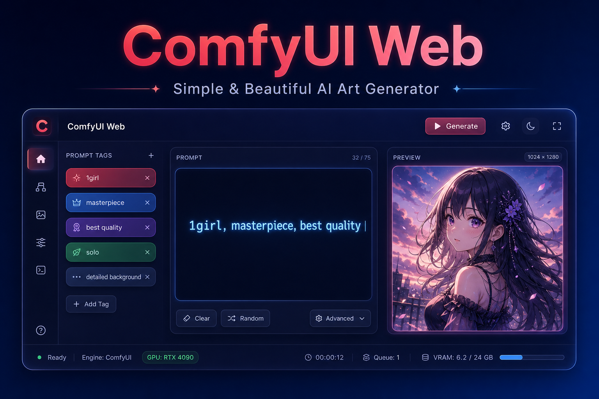

# 🎨 ComfyUI Web



> ✨ 一个轻量级的 ComfyUI 网页端工具，让 AI 绘图变得更简单！

---

## 📥 下载

👉 [**点击下载 ComfyUI-Web 2.0（Windows 免安装版）**](https://github.com/mhmoma/comfyui-Web/releases/download/Webv1.0.0/ComfyUI-Web2.0.exe)

下载后直接双击运行，无需解压，无需安装 Python 🎉

---

## 🌟 功能特性

### 简易模式
- 🖱️ **一键启动** — GUI 启动器，填入地址点击开始就能用
- 🔄 **内置反向代理** — 无需给 ComfyUI 加 CORS 参数
- 🏷️ **标签式提示词** — 分类标签快速构建 Prompt，支持权重调节
- 🧠 **多架构支持** — SDXL (Checkpoint) / Anima (Diffusion Model)
- 🎛️ **丰富的可选模块** — LoRA、高清放大、ControlNet、img2img、区域提示词
- 🎲 **通配符系统** — 内置标签库通配符 + 自定义通配符
- 🔧 **ADetailer 面部修复** — 自动检测并修复人脸/手部细节
- 📊 **图片对比** — 修复前后效果对比滑块

### 工作流模式（v2.0 新增）
- 📂 **自定义工作流导入** — 支持 ComfyUI API/UI 两种 JSON 格式
- 🧩 **智能节点解析** — 自动识别节点参数，生成动态编辑表单
- 📝 **WeiLin 提示词支持** — 自动解码 token 数组，提供可读编辑界面
- 🎨 **LoRA 管理器** — 可视化 LoRA 列表，一键切换启用/禁用和调整强度
- 🏷️ **触发词切换** — 点击标签即可开启/关闭触发词
- 📌 **固定提示词前缀** — 独立展示可编辑的固定前缀提示词
- 🔗 **提示词自动绑定** — 主区域提示词框自动绑定工作流正/负提示词节点
- 💾 **工作流本地存储** — 导入的工作流自动保存，随时切换

### 通用
- 📌 **系统托盘** — 最小化到托盘后台运行
- 📦 **开箱即用** — 单个 exe 文件，不需要任何环境
- 📱 **移动端适配** — 手机浏览器也能用
- 📜 **本地历史记录** — 生成的图片自动保存到本地历史

---

## 🚀 快速开始

1. 启动你的 **ComfyUI** 后端（默认地址 `http://127.0.0.1:8188`）
2. 双击 **ComfyUI-Web.exe**
3. 点击 **「启动服务」** — 浏览器自动打开 🎉

### 使用工作流模式

1. 点击左侧「**工作流模式**」标签页
2. 点击「**导入**」上传 ComfyUI 导出的工作流 JSON
3. 自动解析参数，在表单中调整后点击「**生成图片**」

---

## 💡 工作原理

ComfyUI Web 在你的浏览器和 ComfyUI 后端之间充当代理：

```
浏览器 ←→ ComfyUI Web (8080) ←→ ComfyUI 后端 (8188)
```

它负责托管网页界面、转发 API 请求、自动处理跨域问题。

---

## 🛠️ 开发者指南

直接用 Python 运行：

```bash
# 运行代理服务器
python server.py

# 或使用 GUI 启动器
pip install Pillow pystray
python launcher.py
```

打包成独立 exe：

```bash
pip install pyinstaller Pillow pystray
python -m PyInstaller ComfyUI-Web.spec --noconfirm
```

---

## 📄 License

MIT
