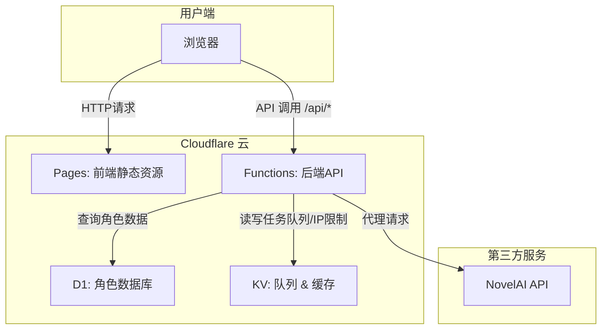

# 🎨 ComfyUI Web - v3.19


> ✨ 一个功能强大、支持本地和线上部署的 ComfyUI 前端界面，让 AI 绘图变得前所未有的简单、灵活和强大！

---

## 🌟 项目形态

本项目包含两种主要运行形态：

1.  **本地版 (Python 代理)**：通过 `launcher.py` 启动，在本机运行一个 Python 服务器。它作为前端界面和本地 ComfyUI 实例之间的桥梁，解决了跨域问题，适合个人在本地快速使用。
2.  **线上版 (Cloudflare)**：一个完全部署在 Cloudflare 生态系统中的 Serverless 应用。它使用 Cloudflare Pages 托管前端，Cloudflare Functions 作为后端 API，Cloudflare D1 作为数据库，Cloudflare KV 作为高速缓存和队列系统。这使得项目可以作为一个高性能、高可用的公共网站运行。

---

## 🚀 核心功能

### 通用功能
- 📱 **全平台适配**：精心设计的响应式界面，在桌面和移动端浏览器上均有良好体验。
- 🎨 **多主题切换**：内置多种主题，包括暗夜、赛博朋克、纯白等，满足个性化需求。
- 📜 **本地历史记录**：所有生成的图片都会自动保存在浏览器本地，方便随时查看。
- 📥 **图片参数解析**：支持拖拽或上传其他 AI 生成的图片，自动解析并填充生成参数。

### 简易模式
- 🧠 **双架构支持**：完美支持 `SDXL (Checkpoint)` 和 `Anima` 两种主流模型架构。
- 🏷️ **标签化提示词**：内置海量分类标签，支持中英文搜索和一键添加，彻底告别手打 Prompt 的烦恼。
- 🎲 **高级通配符**：支持 `__类别名__` 格式的通配符，并提供可视化界面管理自定义通配符库。
- 🎛️ **全功能模块**：
    - **LoRA**: 支持同时加载和调整多个 LoRA 模型权重。
    - **高清放大 (Hires Fix)**: 一键提升图片分辨率和细节。
    - **ControlNet**: 支持多种预处理器，自动预览，精准控制画面。
    - **参考图 (img2img)**: 基于现有图片进行重绘。
    - **区域提示词 (Regional Prompt)**: 可视化分区绘制，对画面不同区域使用不同提示词。
    - **ADetailer**: 自动检测和修复人脸、手部等细节。
- 📊 **效果对比**: 支持对经过 ADetailer 或高清放大处理的图片进行“修复前/修复后”的滑块对比。

### 工作流模式
- 📂 **智能工作流导入**: 兼容 ComfyUI API 和 UI 导出的 JSON，自动解析节点并生成可视化编辑表单。
- 💾 **本地存储**: 导入的工作流会自动保存在浏览器中，方便随时切换使用。

### 在线生图 (NAI) 模式 - (线上版专属)
- ☁️ **API 代理**：用户无需提供自己的 API Key，所有请求通过服务器后端转发，安全可靠。
- ⚙️ **智能队列系统**:
    - **单任务锁**: 基于 Cloudflare KV 实现，确保同一时间只有一个生图任务在运行，避免 API 并发问题。
    - **排队机制**: 当有任务在运行时，新请求会自动进入队列，并向用户实时反馈排队位置。
    - **IP 速率限制**: 限制每个 IP 每小时的请求次数，防止服务被滥用。
- 💎 **高级功能支持**:
    - **视频生成 (wan2-2)**：支持图像到视频的生成。
    - **视频码验证**: 视频生成需要使用在指定渠道获取的、一次性的“视频码”，后端通过 KV 数据库进行严格验证，确保资源公平使用。
    - **管理员特权**: 管理员可通过特定 `x-admin-key` 免除限制并拥有插队权限。

---

## 🏗️ 技术架构 (线上版)

- **前端 (Frontend)**: `Cloudflare Pages` - 托管由 HTML, CSS, JavaScript 构成的静态网站。
- **后端 (Backend)**: `Cloudflare Functions` - Serverless 函数，处理 API 请求，如 NAI 生图代理、D1 数据库查询等。
- **数据库 (Database)**: `Cloudflare D1` - 一个基于 SQLite 的 Serverless 数据库，用于存储数万条角色和系列数据，支持前端进行快速搜索。
- **键值存储 (KV Store)**: `Cloudflare KV` - 用于实现 NAI 生图模式下的任务锁、等待队列、IP 速率限制记录、视频码验证等高性能读写场景。



---

## 🛠️ 本地开发与启动

1.  **环境准备**: 确保已安装 `Python`。
2.  **安装依赖**:
    ```bash
    pip install Pillow pystray
    ```
3.  **启动 ComfyUI**: 确保你的 ComfyUI 实例正在运行 (默认地址 `http://127.0.0.1:8188`)。
4.  **启动本地代理服务**:
    ```bash
    python launcher.py
    ```
    程序会自动在浏览器中打开 `http://127.0.0.1:8080`。

---

## ☁️ 部署指南 (线上版)

本项目的部署与 Cloudflare Pages 深度绑定，采用“**阶段化提交**”策略，`deploy/` 目录是唯一的部署源。

### 1. Cloudflare 平台配置 (一次性)
- 登录 Cloudflare -> Pages -> 选择 `comfyui-web` 项目。
- 进入 `设置` > `构建和部署`。
- 将 **构建输出目录** 设置为 `/deploy`。
- 将 **构建命令** 设为 **留空**。

### 2. 日常部署步骤
1.  **同步文件**: 将根目录的最新版核心文件，覆盖到 `deploy/` 目录中。
    ```powershell
    Copy-Item -Path "index.html", "script.js", "style.css" -Destination "deploy/" -Force
    ```
    *注意：`tags.json` 和 `characters.json` 等数据文件如果过大或不常变动，可以不每次都同步。*

2.  **提交更改**: 将对 `deploy/` 目录的修改提交到 Git。
    ```powershell
    git add deploy/
    git commit -m "feat: Sync latest changes to deploy directory"
    ```

3.  **推送部署**: 将 commit 推送到 `origin` 的 `main` 分支，即可触发 Cloudflare 的自动部署。
    ```powershell
    # 默认使用 7890 端口代理进行推送
    git -c http.proxy="http://127.0.0.1:7890" -c https.proxy="http://127.0.0.1:7890" push origin main

    # 若代理推送失败，再尝试清空代理后仅推 origin
    # $env:ALL_PROXY=''; $env:HTTP_PROXY=''; $env:HTTPS_PROXY=''
    # git push origin main
    ```
    > **⚠️ PowerShell 命令警告**: 在 PowerShell 终端中，**严禁使用 `&&`** 连接多个命令。请将命令分行执行，或使用分号 `;` (如果适用)。

---

## 📄 License

MIT
